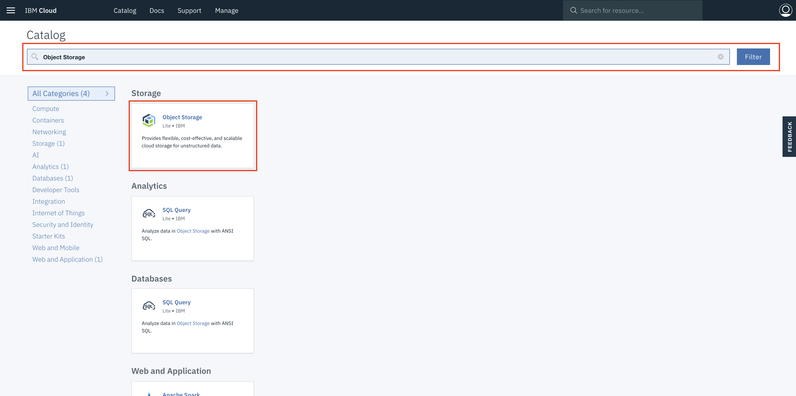
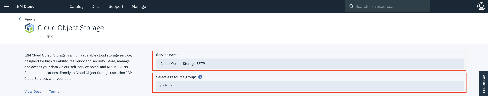
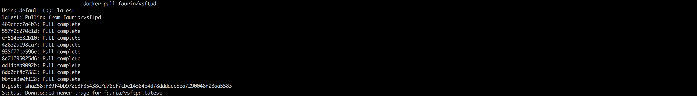

 

# HEADING ( HELP ME WITH THIS PLEASE :) )

## Prerequisite

- **IBM Cloud CLI & IBM Kubernetes Service Plugin**
  ```
  curl -sL https://ibm.biz/idt-installer | bash
  ```

- **IBM Cloud Container Registry Plugin**
  ```
  ibmcloud plugin install container-registry -r Bluemix
  ```
- [Docker](https://docs.docker.com/install/)

### Step 1:- Create A Kubernetes Cluster

- Go to your **IBM Cloud Portal** and [Sign in](https://console.bluemix.net/dashboard/apps/)
- Navigate to **IBM Kubernetes Service** by clicking on **Containers** in the hamburger icon.


- Click on **Create Cluster**


- Select the **region** where you want to deploy the cluster, give a **name** to your cluster and click on **create cluster**.
- Depending upon your account (**Paid or Free**), select the appropriate cluster type. Paid option allows the creation of multiple worker nodes to provide higher availability and should be used for any production workloads.
- It takes some time for cluster to get ready (around 30 mins).


- Once the cluster is ready, click on your cluster name and you will be redirected to a new page containing information regarding your cluster and worker node.


- Click on worker node tab, to get cluster's **Public IP**.


### Step 2:- Deploy an IBM Cloud Object Storage service instance.

- Go to your **IBM Cloud Portal** and [Sign in](https://console.bluemix.net/dashboard/apps/).
- Navigate to **IBM Cloud Catalog** by clicking on **Catalog** tab located in the top left corner.

  

- On search texbox, type **Object Storage**.

  

- Select **Object Storage** service and it will open the **IBM Cloud Object Storage catalog page**.
- Enter a **name** for your service instance and **select the same resource group** that your cluster is in. To view the resource group of your cluster, run 
  ```
  ibmcloud cs cluster-get-cluster <cluster_name_or_ID>
  ```

  
- Review the [plan options](https://www.ibm.com/cloud-computing/bluemix/pricing-object-storage#s3api) for **pricing information** and select a plan.
- Click **Create**. 

  

- After few seconds object storage service will be created and the service details page opens.
- In the navigation on the service details page, click **Service Credentials**.
- Click **New credential**. A dialog box will appear.

  

- Enter **name** for your credentials.
- From the **Role** drop-down, select **Writer** or **Manager**. When you select Reader, you can not use the credentials to create buckets in IBM Cloud Object Storage and write data to it.
- In **Add Inline Configuration Parameters (Optional)**, enter **{"HMAC":true}** to create additional HMAC credentials for the IBM Cloud Object Storage service. HMAC authentication adds an **extra layer of security to the OAuth2 authentication by preventing the misuse of expired or randomly created OAuth2 tokens**.
- Click **Add**. Your new credentials are listed in the Service Credentials table.

  

- Click View credentials.
- Make note of the apikey to use OAuth2 tokens to authenticate with the IBM Cloud Object Storage service. For HMAC authentication, in the cos_hmac_keys section, note the **access_key_id** and the **secret_access_key**.

  


### Step 3:- Build and Upload SFTP container image to IBM Cloud Container Registry

We will pull an existing SFTP container image from docker hub, make few changes to it and upload it to IBM Cloud Container Registry (Private).

- First Login into your IBM Cloud account.For Example 'ibmcloud login -a https://api.eu-gb.bluemix.net' for UK region
  ```
  ibmcloud login -a <region_endpoint>
  ```

- Set your organisation and space. You can get this from your Bluemix dashboard
  ```
  ibmcloud target -o "<organisation_name>" -s "<space_name>"
  ```

- Target the IBM Cloud Container Service region in which you want to work. You can get this from your Bluemix dashboard. For Example **ibmcloud cs region-set uk-south**
  ```
  ibmcloud cs region-set <service_region>
  ```
  
- Once you are successfully logged into your IBM Cloud account, pull a base docker image of SFTP from **Docker Hub**. Note that you need to have a **Docker Client** running otherwise the command will return an error.

  

  ```
  docker pull fauria/vsftpd
  ```

  

#### Once pull is complete, next we need to make changes to this base image and upload it **IBM Cloud Container Registry (Private)**. Follow the steps below.

**Execute each command mentioned below step by step**

  ```
  ibmcloud cr namespace-add <my_namespace>
  ```

  

  ```
  ibmcloud cr login
  ```

  

  ```
  docker tag fauria/vsftpd registry.eu-gb.bluemix.net/<my_namespace>/fauria/vsftpd:latest
  ```
    

  ```
  docker push registry.eu-gb.bluemix.net/<my_namespace>/fauria/vsftpd:latest
  ```

  

- After executing the commands mentioned above, check weather the image is uploaded correctly either by executing the command mentioned below or by going to IBM Cloud Container Registry dashboard
  - **Option 1:- CLI Command**
  ```
  ibmcloud cr image-list
  ```
  
  
  - **Option 2:- IBM Cloud Container Registry Dashboard**

  

  - Note:- Keep a note of the image link which is highlighted in the green box, it will be used later.

### Step 2:- Deploy the SFTP Service To IBM Cloud Kubernetes Service And Create Persistant Volume To Store the Data.

#### 
- After the cluster is deployed successfully, go to Github and [clone or download the repository](https://github.com/sudoalgorithm/SSH-File-Transfer-Protocol-On-IBM-Cloud-Kubernetes-Services.git). 


 Once the repository is on your local system switch to inside the main directory **kubernetes-sftp directory**. Inside the directory you will find 5 file required to deploy the **SFTP Service Container** on to kuberentes and create a **Persistant Volume**.

**Execute each command mentioned below step by step**

- Note:- Get the **Cluster Name** from IBM Cloud Dashboard.

- Get the command to set the environment variable and download the Kubernetes configuration files.

```
ibmcloud cs cluster-config <name_of_the_cluster>
```


- Copy the environment variables generated after executing previous command and paste it in the terminal.


- Verify that you can connect to your cluster by listing your worker nodes.

```
kubectl get nodes
```


```
kubectl create -f task-pv-volume.yaml
```

```
kubectl get pv task-pv-volume
```


```
kubectl create -f task-pv-claim.yaml
```

```
kubectl get pvc task-pv-claim
```


- Note:- Ensure **line 18** in the sftp-deployment.yaml matches the image link noted earlier in the green box.

```
kubectl create -f sftp-deployment.yaml
```

```
kubectl create -f sftp-service.yaml
```

```
kubectl create -f sftp-ingress.yaml
```

