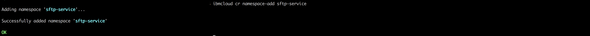

# Deploy SFTP (SHH File Transfer Protocol) Service On IBM Cloud Kubernetes Service

## Prerequisite

- [Docker CLI](https://docs.docker.com/install/)
- [IBM Cloud CLI](https://console.bluemix.net/docs/cli/reference/bluemix_cli/get_started.html#getting-started)
- [Kubernetes CLI](https://kubernetes.io/docs/tasks/tools/install-kubectl/)

### Step 1:- Build and Upload SFTP container image to IBM Cloud Container Registry

In step 1 we will pull an existing SFTP container image from docker hub, make few changes to it and upload it to IBM Cloud Container Registry (Private).

- First Login into your IBM Cloud account.

  ```
  ibmcloud login -a <region_endpoint>
  ```

- Set your organisation and space.
  ```
  ibmcloud target -o "<organisation_name>" -s "<space_name>"
  ```


- Once you are successfully logged into your IBM Cloud account, pull a base docker image of SFTP from docker hub.

  ```
  docker pull fauria/vsftpd
  ```

  

- Once pull is complete, next we need to make changes to this base image and upload it IBM Cloud container registry (Private).

- Note:- Execute each command mentioned below step by step

  ```
  ibmcloud plugin install container-registry -r Bluemix
  ```

  

  ```
  ibmcloud cr namespace-add <my_namespace>
  ```

  

  ```
  ibmcloud cr login
  ```

  

  ```
  docker tag fauria/vsftpd registry.eu-gb.bluemix.net/<my_namespace>/fauria/vsftpd:latest
  ```

  ```
  docker push registry.eu-gb.bluemix.net/<my_namespace>/fauria/vsftpd:latest
  ```

  

- After executing the commands mentioned above, check weather the image is uploaded correctly or not by executing the command :-
  ```
  ibmcloud cr image-list
  ```
  

### Step 2:- Deploy the SFTP Service To IBM Cloud Kubernetes Service And Create Persistant Volume To Store the Data.

#### Create A Kubernetes Cluster

- Go to your **IBM Cloud Dashboard** and [Sign in](https://console.bluemix.net/dashboard/apps/)
- Go to **IBM Kubernetes Service**


- Click on **Create Cluster**


- Select the **region** where you want to deploy the cluster, give a **name** to your cluster and click on **create cluster**.
- Depending upon your account (**Paid or Free**), select the appropriate cluster type.
- It takes some time for cluster to get ready (around 30 mins).


- Once the cluster is ready, click on your cluster name and you will be redirected to a new page containing information regarding your cluster and worker node.


- Click on worker node tab, to get cluster's **Public IP**.


- After the cluster is deployed successfully, go back to github and clone or download the repository.

- Once the repository is on your local system switch to inside the main directory **kubernetes-sftp directory**.Inside the directory you will find 5 file required to deploy the SFTP service container on to kuberentes and create a persistant volume.

- Execute each command mentioned below step by step

```
kubectl create -f task-pv-volume.yaml
```

```
kubectl get pv task-pv-volume
```

```
kubectl create -f task-pv-claim.yaml
```

```
kubectl get pvc task-pv-claim
```

```
kubectl create -f ftp-deployment.yaml
```

```
kubectl create -f ftp-service.yaml
```

```
kubectl create -f ftp-ingress.yaml
```
