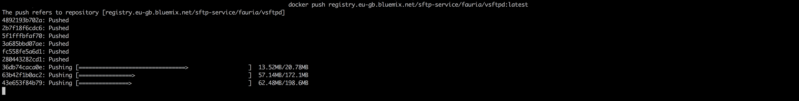
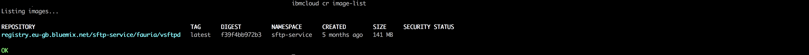

# Deploy SFTP (SHH File Transfer Protocol) On IBM Cloud Kubernetes Service

## Prerequisite

- [Docker CLI](https://docs.docker.com/install/)
- [IBM Cloud CLI](https://console.bluemix.net/docs/cli/reference/bluemix_cli/get_started.html#getting-started)
- [Kubernetes CLI](https://kubernetes.io/docs/tasks/tools/install-kubectl/)

### Step - 1 Build and Upload SFTP container image to IBM Cloud Container Registry

In step 1 we will pull an existing SFTP container image from docker hub, make few changes to it and upload it to IBM Cloud Container Registry (Private).

- First Login into your IBM Cloud account.

  ```
  ibmcloud login -a <region_endpoint>
  ```

- Set your organisation and space.
  ```
  ibmcloud target -o "<organisation_name>" -s "<space_name>"
  ```


- Once you are successfully logged into your IBM Cloud account, pull a base docker image of SFTP from docker hub.

  ```
  docker pull fauria/vsftpd
  ```

  

- Once pull is complete, next we need to make changes to this base image and upload it IBM Cloud container registry (Private).

- Note:- Execute each command step by step

  ```
  ibmcloud plugin install container-registry -r Bluemix
  ```

  

  ```
  ibmcloud cr namespace-add <my_namespace>
  ```

  

  ```
  ibmcloud cr login
  ```

  

  ```
  docker tag fauria/vsftpd registry.eu-gb.bluemix.net/<my_namespace>/fauria/vsftpd:latest
  ```

  ```
  docker push registry.eu-gb.bluemix.net/<my_namespace>/fauria/vsftpd:latest
  ```

  

- After executing the commands mentioned above, check weather the image is uploaded correctly or not by executing the command :-
  ```
  ibmcloud cr image-list
  ```
  

### Step - 2 Build and Upload SFTP container image to IBM Cloud Container Registry
