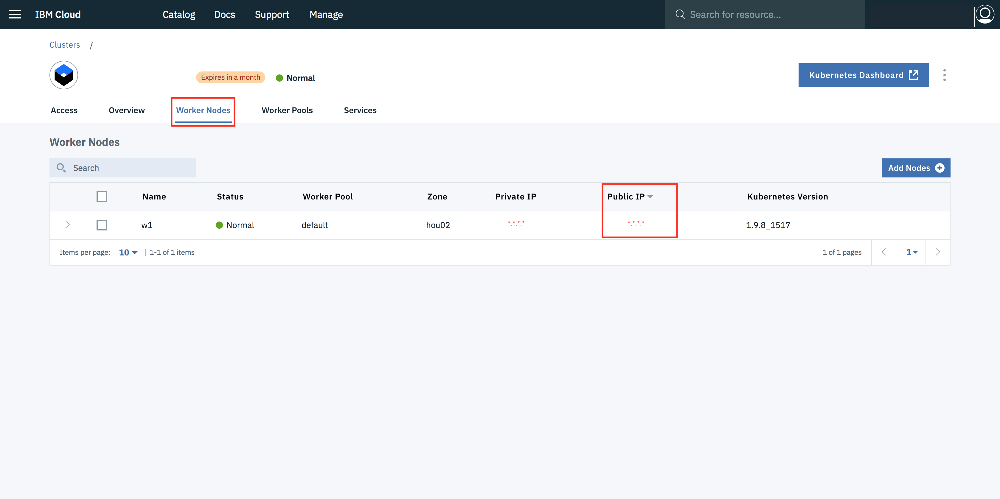

 

# SFTP application modernization on IBM Cloud Kubernetes Service and Object Storage

## Prerequisite

- **IBM Cloud CLI & IBM Kubernetes Service Plugin**
  ```
  curl -sL https://ibm.biz/idt-installer | bash
  ```

- **IBM Cloud Container Registry Plugin**
  ```
  ibmcloud plugin install container-registry -r Bluemix
  ```
- [Docker](https://docs.docker.com/install/)
- [Clone or download the repository from github](https://github.com/sudoalgorithm/SSH-File-Transfer-Protocol-On-IBM-Cloud-Kubernetes-Services.git)

### Step 1:- Deploy A Kubernetes Cluster

- Go to your **IBM Cloud Portal** and [Sign in](https://console.bluemix.net/dashboard/apps/)
- Navigate to **IBM Kubernetes Service** by clicking on **Containers** in the hamburger icon.


- Click on **Create Cluster**


- Select the **region** where you want to deploy the cluster, give a **name** to your cluster and click on **create cluster**.
- Depending upon your account (**Paid or Free**), select the appropriate cluster type. Paid option allows the creation of multiple worker nodes to provide higher availability and should be used for any production workloads.
- It takes some time for cluster to get ready (around 30 mins).


- Once the cluster is ready, click on your cluster name and you will be redirected to a new page containing information regarding your cluster and worker node.


- Click on worker node tab, to get cluster's **Public IP**.



### Step 2:- Deploy an IBM Cloud Object Storage service instance.

- Go to your **IBM Cloud Portal** and [Sign in](https://console.bluemix.net/dashboard/apps/).
- Navigate to **IBM Cloud Catalog** by clicking on **Catalog** tab located in the top left corner.

  

- On search texbox, type **Object Storage**.

  

- Select **Object Storage** service and it will open the **IBM Cloud Object Storage catalog page**.
- Enter a **name** for your service instance and **select the same resource group** that your cluster is in. To view the resource group of your cluster, run 
  ```
  ibmcloud cs cluster-get-cluster <cluster_name_or_ID>
  ```

  
- Review the [plan options](https://www.ibm.com/cloud-computing/bluemix/pricing-object-storage#s3api) for **pricing information** and select a plan.
- Click **Create**. 

  

- After few seconds object storage service will be created and the service details page opens.
- In the navigation on the service details page, click **Service Credentials**.
- Click **New credential**. A dialog box will appear.

  

- Enter **name** for your credentials.
- From the **Role** drop-down, select **Writer** or **Manager**. When you select Reader, you can not use the credentials to create buckets in IBM Cloud Object Storage and write data to it.
- In **Add Inline Configuration Parameters (Optional)**, enter **{"HMAC":true}** to create additional HMAC credentials for the IBM Cloud Object Storage service. HMAC authentication adds an **extra layer of security to the OAuth2 authentication by preventing the misuse of expired or randomly created OAuth2 tokens**.
- Click **Add**. Your new credentials are listed in the Service Credentials table.

  

- Click **View credentials**.
- Make note of the apikey to use OAuth2 tokens to authenticate with the IBM Cloud Object Storage service. For HMAC authentication, in the cos_hmac_keys section, note the **access_key_id** and the **secret_access_key**.

  

### Step 3:- Installing the IBM Cloud Object Storage plug-in.

Install the IBM Cloud Object Storage plug-in with a Helm chart to set up pre-defined storage classes for IBM Cloud Object Storage. Use these storage classes to create a PVC to provision IBM Cloud Object Storage for the SFTP service.

- First Login into your IBM Cloud account.For Example 'ibmcloud login -a https://api.eu-gb.bluemix.net' for UK region
  ```
  ibmcloud login -a <region_endpoint>
  ```
- Set your organisation and space. You can get this from your Bluemix dashboard
  ```
  ibmcloud target -o "<organisation_name>" -s "<space_name>"
  ```
Follow the instructions to install the Helm client on your local machine, install the Helm server (tiller) in your cluster, and add the IBM Cloud Helm chart repository to the cluster where you want to use the IBM Cloud Object Storage plug-in.

- Add the IBM Cloud Helm repo to your cluster. 
  ```
  helm repo add ibm https://registry.bluemix.net/helm/ibm
  ```
- Update the Helm repo to retrieve the latest version of all Helm charts in this repo.
  ```
  helm repo update
  ```
- Download the Helm charts and unpack the charts in your current directory.
  ```
  helm fetch --untar ibm/ibmcloud-object-storage-plugin
  ```
If you use macOS or a Linux distribution, install the IBM Cloud Object Storage Helm plug-in ibmc. The plug-in is used to automatically retrieve your cluster location and to set the API endpoint for your IBM Cloud Object Storage buckets in your storage classes. If you use Windows as your operating system, continue with the next step.
- Install the Helm plug-in.
  ```
  helm plugin install ibmcloud-object-storage-plugin/helm-ibmc
  ```
- Verify that the ibmc plug-in is installed successfully.
  ```
  helm ibmc --help
  ```

### Step 4:- Creating a secret for the object storage service credentials.

To access your IBM Cloud Object Storage service instance to read and write data, you must securely store the service credentials in a Kubernetes secret. The IBM Cloud Object Storage plug-in uses these credentials for every read or write operation to your bucket.

- Retrieve the **apikey**, or the **access_key_id** and the **secret_access_key** of your IBM Cloud Object Storage service credentials.
- Get the **GUID** of your IBM Cloud Object Storage service instance.
  ```
  ibmcloud resource service-instance <service_name> | grep GUID
  ```
- Encode the IBM Cloud Object Storage **GUID**, **apikey**, **access_key_id** and **secret_access_key** that you retrieved earlier to base64 and note all the base64 encoded values. Repeat this command for each parameter to retrieve the base 64 encoded value.
- Change the value (**access-key, secret-key, api-key, service-instance-id**) in **sftp-secret.yaml** to define your Kubernetes secret.
- Create the secret in your cluster.
  ```
  kubectl create -f sftp-secret.yaml
  ```
- Verify that the secret is created in your namespace.
  ```
  kubectl get secret
  ```

### Step 5:- Limit the IBM Cloud Object Storage plug-in to access only the Kubernetes secrets that hold your IBM Cloud Object Storage service credentials.

- Navigate to the templates directory and list available files.
  ```
  cd ibmcloud-object-storage-plugin/templates && ls
  ```
- Open the provisioner-sa.yaml file and look for the ibmcloud-object-storage-secret-reader ClusterRole definition.
- Add the name of the secret that you created earlier to the list of secrets that the plug-in is authorized to access in the resourceNames section.
  ```
  kind: ClusterRole
  apiVersion: rbac.authorization.k8s.io/v1beta1
  metadata:
    name: ibmcloud-object-storage-secret-reader
  rules:
  - apiGroups: [""]
    resources: ["secrets"]
    resourceNames: ["<secret_name1>"]
    verbs: ["get"]
  ```
- Save your changes.
- Install the IBM Cloud Object Storage plug-in. When you install the plug-in, pre-defined storage classes are added to your cluster.
  - For macOS and Linux:
    ```
    helm ibmc install ./ibmcloud-object-storage-plugin -f ibmcloud-object-storage-plugin/ibm/values.yaml
    ```
- Verify that the plug-in is installed correctly.
    ```
    kubectl get pod -n kube-system -o wide | grep object
    ```
    The installation is successful when you see one ibmcloud-object-storage-plugin pod and one or more ibmcloud-object-storage-driver pods. The number of ibmcloud-object-storage-driver pods equals the number of worker nodes in your cluster. All pods must be in a Running state for the plug-in to function properly. 
    If the pods fail, run
    ```
    kubectl describe pod -n kube-system <pod_name> 
    ```
    to find the root cause for the failure.

- Verify that the storage classes are created successfully.
    ```
    kubectl get storageclass | grep s3
    ```

### Step 6:- Build and Upload SFTP container image to IBM Cloud Container Registry

- Target the IBM Cloud Container Service region in which you want to work. You can get this from your Bluemix dashboard. For Example **ibmcloud cs region-set uk-south**
  ```
  ibmcloud cs region-set <service_region>
  ```
  
- Once you are successfully logged into your IBM Cloud account, pull a base docker image of SFTP from **Docker Hub**. Note that you need to have a **Docker Client** running otherwise the command will return an error.

  

  ```
  docker pull fauria/vsftpd
  ```

  

#### Once pull is complete, next we need to make changes to this base image and upload it **IBM Cloud Container Registry (Private)**. Follow the steps below.

**Execute each command mentioned below step by step**

  ```
  ibmcloud cr namespace-add <my_namespace>
  ```

  

  ```
  ibmcloud cr login
  ```

  

  ```
  docker tag fauria/vsftpd registry.eu-gb.bluemix.net/<my_namespace>/fauria/vsftpd:latest
  ```
    

  ```
  docker push registry.eu-gb.bluemix.net/<my_namespace>/fauria/vsftpd:latest
  ```

  

- After executing the commands mentioned above, check weather the image is uploaded correctly either by executing the command mentioned below or by going to IBM Cloud Container Registry dashboard
  - **Option 1:- CLI Command**
  ```
  ibmcloud cr image-list
  ```
  
  
  - **Option 2:- IBM Cloud Container Registry Dashboard**

  

  - Note:- Keep a note of the image link which is highlighted in the green box, it will be used later.

### Step 2:- Deploy the SFTP Service To IBM Cloud Kubernetes Service And Create Persistant Volume To Store the Data in Object Storage.

Switch to **kubernetes-sftp directory**. Inside the directory you will find 5 file required to deploy the **SFTP Service Container** on to kuberentes and create a **Persistant Volume**.

**Execute each command mentioned below step by step**

- Note:- Get the **Cluster Name** from IBM Cloud Dashboard.

- Get the command to set the environment variable and download the Kubernetes configuration files.

```
ibmcloud cs cluster-config <name_of_the_cluster>
```


- Copy the environment variables generated after executing previous command and paste it in the terminal.


- Verify that you can connect to your cluster by listing your worker nodes.

  ```
  kubectl get nodes
  ```


- Create a Persistant Volume claim.

  ```
  kubectl create -f task-pv-claim.yaml
  ```
  ```
  kubectl get pvc task-pv-claim
  ```
  ```
  kubectl describe task-pv-claim
  ```
- Note:- Ensure **line 18** in the sftp-deployment.yaml matches the image link noted earlier in the green box.
  ```
  kubectl create -f sftp-deployment.yaml
  ```
  ```
  kubectl create -f sftp-service.yaml
  ```

