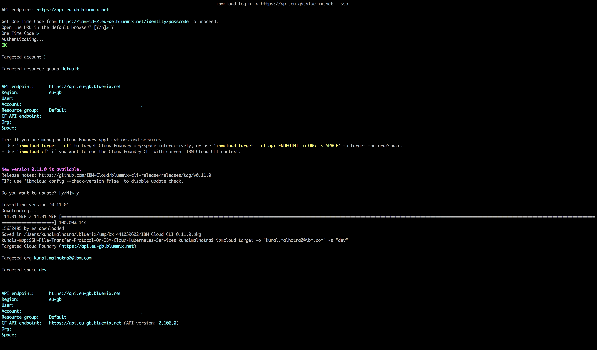
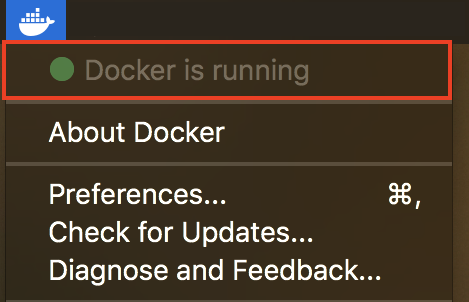
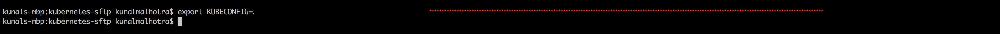

# Deploy SFTP (SSH File Transfer Protocol) Service On IBM Cloud Kubernetes Service

## Prerequisite

- [IBM Cloud CLI](https://console.bluemix.net/docs/cli/reference/bluemix_cli/get_started.html#getting-started)
- [Docker CLI](https://docs.docker.com/install/)
- **IBM Cloud Container Registry Plugin**

  ```
  ibmcloud plugin install container-registry -r Bluemix
  ```
- **IBM Cloud IBM Kubernetes Service Plugin**
  ```
  curl -sL https://ibm.biz/idt-installer | bash
  ```

### Step 1:- Build and Upload SFTP container image to IBM Cloud Container Registry

In step 1 we will pull an existing SFTP container image from docker hub, make few changes to it and upload it to IBM Cloud Container Registry (Private).

- First Login into your IBM Cloud account.For Example 'ibmcloud login -a https://api.eu-gb.bluemix.net' for UK region
  ```
  ibmcloud login -a <region_endpoint>
  ```

- Set your organisation and space. You can get this from your Bluemix dashboard
  ```
  ibmcloud target -o "<organisation_name>" -s "<space_name>"
  ```
  

- Target the IBM Cloud Container Service region in which you want to work. You can get this from your Bluemix dashboard. For Example ibmcloud cs region-set uk-south
  ```
  ibmcloud cs region-set <service_region>
  ```
  
- Once you are successfully logged into your IBM Cloud account, pull a base docker image of SFTP from **Docker Hub**. Note that you need to have a **Docker Client** running otherwise the command will return an error).

    

  ```
  docker pull fauria/vsftpd
  ```

  

#### Once pull is complete, next we need to make changes to this base image and upload it **IBM Cloud Container Registry (Private)**. Follow the steps below.

**Execute each command mentioned below step by step**

  ```
  ibmcloud cr namespace-add <my_namespace>
  ```

  

  ```
  ibmcloud cr login
  ```

  

  ```
  docker tag fauria/vsftpd registry.eu-gb.bluemix.net/<my_namespace>/fauria/vsftpd:latest
  ```
    

  ```
  docker push registry.eu-gb.bluemix.net/<my_namespace>/fauria/vsftpd:latest
  ```

  

- After executing the commands mentioned above, check weather the image is uploaded correctly either by executing the command mentioned below or by going to IBM Cloud Container Registry dashboard
  - **Option 1:- CLI Command**
  ```
  ibmcloud cr image-list
  ```
  
  
  - **Option 2:- IBM Cloud Container Registry Dashboard**

  

### Step 2:- Deploy the SFTP Service To IBM Cloud Kubernetes Service And Create Persistant Volume To Store the Data.

#### Create A Kubernetes Cluster

- Go to your **IBM Cloud Portal** and [Sign in](https://console.bluemix.net/dashboard/apps/)
- Go to **IBM Kubernetes Service** by clicking on **Containers** in the hamburger menu.


- Click on **Create Cluster**


- Select the **region** where you want to deploy the cluster, give a **name** to your cluster and click on **create cluster**.
- Depending upon your account (**Paid or Free**), select the appropriate cluster type. Paid option allows the creation of multiple worker nodes to provide higher availability and should be used for any production workloads.
- It takes some time for cluster to get ready (around 30 mins).


- Once the cluster is ready, click on your cluster name and you will be redirected to a new page containing information regarding your cluster and worker node.


- Click on worker node tab, to get cluster's **Public IP**.


- After the cluster is deployed successfully, go back to [github and clone or download the repository](https://github.com/sudoalgorithm/SSH-File-Transfer-Protocol-On-IBM-Cloud-Kubernetes-Services.git). 


 Once the repository is on your local system switch to inside the main directory **kubernetes-sftp directory**. Inside the directory you will find 5 file required to deploy the **SFTP Service Container** on to kuberentes and create a **Persistant Volume**.

**Execute each command mentioned below step by step**

- Target the IBM Cloud Container Service region in which you want to work.

```
ibmcloud cs region-set us-south
```


- Get the command to set the environment variable and download the Kubernetes configuration files.

```
ibmcloud cs cluster-config SFTP-Service-Cluster
```


- Copy the environment variables generated after executing previous command and paste it in the terminal.



- Verify that you can connect to your cluster by listing your worker nodes.

```
kubectl get nodes
```


```
kubectl create -f task-pv-volume.yaml
```

```
kubectl get pv task-pv-volume
```


```
kubectl create -f task-pv-claim.yaml
```

```
kubectl get pvc task-pv-claim
```


```
kubectl create -f sftp-deployment.yaml
```

```
kubectl create -f sftp-service.yaml
```

```
kubectl create -f sftp-ingress.yaml
```

